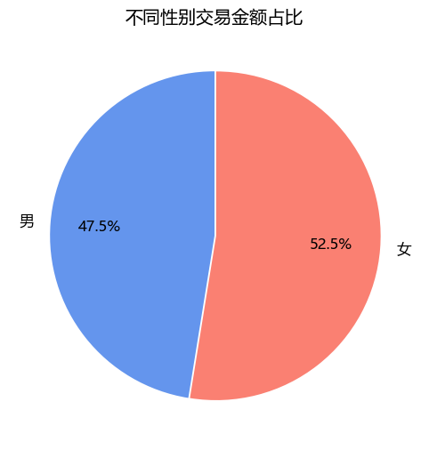
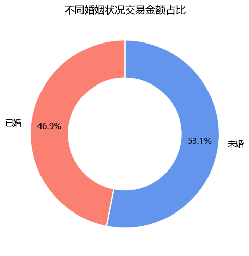
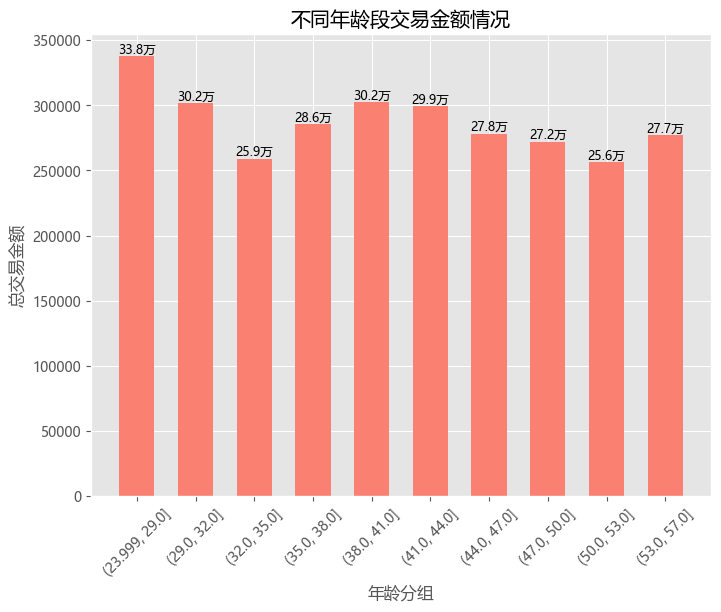

```python
import pandas as pd
import matplotlib.pyplot as plt
import matplotlib.style as psl
```


```python
data = pd.read_csv('用户下单数据.csv',
                   engine='python',
                   encoding='gbk')
```


```python
data.head()
```


<div>
<style scoped>
    .dataframe tbody tr th:only-of-type {
        vertical-align: middle;
    }

    .dataframe tbody tr th {
        vertical-align: top;
    }

    .dataframe thead th {
        text-align: right;
    }
</style>
<table border="1" class="dataframe">
  <thead>
    <tr style="text-align: right;">
      <th></th>
      <th>用户ID</th>
      <th>用户出生日期</th>
      <th>性别</th>
      <th>婚姻状况</th>
      <th>文化程度</th>
      <th>下单时间</th>
      <th>订单ID</th>
      <th>交易金额</th>
    </tr>
  </thead>
  <tbody>
    <tr>
      <th>0</th>
      <td>6414111</td>
      <td>1991/8/24</td>
      <td>男</td>
      <td>已婚</td>
      <td>本科</td>
      <td>2020/1/1 17:41</td>
      <td>1000595826</td>
      <td>402.765811</td>
    </tr>
    <tr>
      <th>1</th>
      <td>6516117</td>
      <td>1983/7/21</td>
      <td>女</td>
      <td>已婚</td>
      <td>博士</td>
      <td>2021/10/15 22:47</td>
      <td>1000610643</td>
      <td>545.273062</td>
    </tr>
    <tr>
      <th>2</th>
      <td>6714112</td>
      <td>1986/6/21</td>
      <td>女</td>
      <td>已婚</td>
      <td>博士</td>
      <td>2020/11/22 09:45</td>
      <td>1001934364</td>
      <td>256.716973</td>
    </tr>
    <tr>
      <th>3</th>
      <td>5311117</td>
      <td>1978/5/25</td>
      <td>女</td>
      <td>未婚</td>
      <td>大专</td>
      <td>2021/3/26 11:53</td>
      <td>1007749907</td>
      <td>275.547080</td>
    </tr>
    <tr>
      <th>4</th>
      <td>4316113</td>
      <td>1979/8/1</td>
      <td>男</td>
      <td>未婚</td>
      <td>大专</td>
      <td>2021/7/10 18:59</td>
      <td>1007770144</td>
      <td>1023.500156</td>
    </tr>
  </tbody>
</table>
</div>


```python
data.info()
```

    <class 'pandas.core.frame.DataFrame'>
    RangeIndex: 5000 entries, 0 to 4999
    Data columns (total 8 columns):
     #   Column  Non-Null Count  Dtype  
    ---  ------  --------------  -----  
     0   用户ID    5000 non-null   int64  
     1   用户出生日期  5000 non-null   object 
     2   性别      5000 non-null   object 
     3   婚姻状况    5000 non-null   object 
     4   文化程度    5000 non-null   object 
     5   下单时间    5000 non-null   object 
     6   订单ID    5000 non-null   int64  
     7   交易金额    5000 non-null   float64
    dtypes: float64(1), int64(2), object(5)
    memory usage: 312.6+ KB
    


```python
data['用户ID'] = data['用户ID'].astype('str')
data['订单ID'] = data['订单ID'].astype('str')
data['用户出生日期'] = pd.to_datetime(data['用户出生日期'], format='%Y/%m/%d')
data['下单时间'] = pd.to_datetime(data['下单时间'], format='%Y/%m/%d %H:%M')
data['间隔天数'] = pd.to_datetime('2025/4/22') - data['用户出生日期']
data['间隔天数'] = data['间隔天数'].dt.days
data['年龄'] = (data['间隔天数'] / 365).round(0)
```


```python
data
```


<div>
<style scoped>
    .dataframe tbody tr th:only-of-type {
        vertical-align: middle;
    }

    .dataframe tbody tr th {
        vertical-align: top;
    }

    .dataframe thead th {
        text-align: right;
    }
</style>
<table border="1" class="dataframe">
  <thead>
    <tr style="text-align: right;">
      <th></th>
      <th>用户ID</th>
      <th>用户出生日期</th>
      <th>性别</th>
      <th>婚姻状况</th>
      <th>文化程度</th>
      <th>下单时间</th>
      <th>订单ID</th>
      <th>交易金额</th>
      <th>间隔天数</th>
      <th>年龄</th>
    </tr>
  </thead>
  <tbody>
    <tr>
      <th>0</th>
      <td>6414111</td>
      <td>1991-08-24</td>
      <td>男</td>
      <td>已婚</td>
      <td>本科</td>
      <td>2020-01-01 17:41:00</td>
      <td>1000595826</td>
      <td>402.765811</td>
      <td>12295</td>
      <td>34.0</td>
    </tr>
    <tr>
      <th>1</th>
      <td>6516117</td>
      <td>1983-07-21</td>
      <td>女</td>
      <td>已婚</td>
      <td>博士</td>
      <td>2021-10-15 22:47:00</td>
      <td>1000610643</td>
      <td>545.273062</td>
      <td>15251</td>
      <td>42.0</td>
    </tr>
    <tr>
      <th>2</th>
      <td>6714112</td>
      <td>1986-06-21</td>
      <td>女</td>
      <td>已婚</td>
      <td>博士</td>
      <td>2020-11-22 09:45:00</td>
      <td>1001934364</td>
      <td>256.716973</td>
      <td>14185</td>
      <td>39.0</td>
    </tr>
    <tr>
      <th>3</th>
      <td>5311117</td>
      <td>1978-05-25</td>
      <td>女</td>
      <td>未婚</td>
      <td>大专</td>
      <td>2021-03-26 11:53:00</td>
      <td>1007749907</td>
      <td>275.547080</td>
      <td>17134</td>
      <td>47.0</td>
    </tr>
    <tr>
      <th>4</th>
      <td>4316113</td>
      <td>1979-08-01</td>
      <td>男</td>
      <td>未婚</td>
      <td>大专</td>
      <td>2021-07-10 18:59:00</td>
      <td>1007770144</td>
      <td>1023.500156</td>
      <td>16701</td>
      <td>46.0</td>
    </tr>
    <tr>
      <th>...</th>
      <td>...</td>
      <td>...</td>
      <td>...</td>
      <td>...</td>
      <td>...</td>
      <td>...</td>
      <td>...</td>
      <td>...</td>
      <td>...</td>
      <td>...</td>
    </tr>
    <tr>
      <th>4995</th>
      <td>6518114</td>
      <td>1984-02-28</td>
      <td>女</td>
      <td>已婚</td>
      <td>博士</td>
      <td>2023-05-22 19:11:00</td>
      <td>8991789286</td>
      <td>703.983370</td>
      <td>15029</td>
      <td>41.0</td>
    </tr>
    <tr>
      <th>4996</th>
      <td>3615116</td>
      <td>1977-05-11</td>
      <td>女</td>
      <td>未婚</td>
      <td>中专</td>
      <td>2023-01-19 05:33:00</td>
      <td>8993443974</td>
      <td>468.703603</td>
      <td>17513</td>
      <td>48.0</td>
    </tr>
    <tr>
      <th>4997</th>
      <td>4212112</td>
      <td>1987-09-06</td>
      <td>女</td>
      <td>已婚</td>
      <td>中专</td>
      <td>2022-06-13 11:03:00</td>
      <td>8993812802</td>
      <td>530.658640</td>
      <td>13743</td>
      <td>38.0</td>
    </tr>
    <tr>
      <th>4998</th>
      <td>4812120</td>
      <td>1970-04-29</td>
      <td>女</td>
      <td>已婚</td>
      <td>本科</td>
      <td>2021-11-04 07:16:00</td>
      <td>8993866163</td>
      <td>605.657681</td>
      <td>20082</td>
      <td>55.0</td>
    </tr>
    <tr>
      <th>4999</th>
      <td>5112117</td>
      <td>1993-09-24</td>
      <td>男</td>
      <td>未婚</td>
      <td>大专</td>
      <td>2020-12-18 21:37:00</td>
      <td>8997660647</td>
      <td>254.759645</td>
      <td>11533</td>
      <td>32.0</td>
    </tr>
  </tbody>
</table>
<p>5000 rows × 10 columns</p>
</div>


```python
age_qcut = pd.qcut(data['年龄'], 10)
data['年龄分组'] = age_qcut
```


```python
data
```


<div>
<style scoped>
    .dataframe tbody tr th:only-of-type {
        vertical-align: middle;
    }

    .dataframe tbody tr th {
        vertical-align: top;
    }

    .dataframe thead th {
        text-align: right;
    }
</style>
<table border="1" class="dataframe">
  <thead>
    <tr style="text-align: right;">
      <th></th>
      <th>用户ID</th>
      <th>用户出生日期</th>
      <th>性别</th>
      <th>婚姻状况</th>
      <th>文化程度</th>
      <th>下单时间</th>
      <th>订单ID</th>
      <th>交易金额</th>
      <th>间隔天数</th>
      <th>年龄</th>
      <th>年龄分组</th>
    </tr>
  </thead>
  <tbody>
    <tr>
      <th>0</th>
      <td>6414111</td>
      <td>1991-08-24</td>
      <td>男</td>
      <td>已婚</td>
      <td>本科</td>
      <td>2020-01-01 17:41:00</td>
      <td>1000595826</td>
      <td>402.765811</td>
      <td>12295</td>
      <td>34.0</td>
      <td>(32.0, 35.0]</td>
    </tr>
    <tr>
      <th>1</th>
      <td>6516117</td>
      <td>1983-07-21</td>
      <td>女</td>
      <td>已婚</td>
      <td>博士</td>
      <td>2021-10-15 22:47:00</td>
      <td>1000610643</td>
      <td>545.273062</td>
      <td>15251</td>
      <td>42.0</td>
      <td>(41.0, 44.0]</td>
    </tr>
    <tr>
      <th>2</th>
      <td>6714112</td>
      <td>1986-06-21</td>
      <td>女</td>
      <td>已婚</td>
      <td>博士</td>
      <td>2020-11-22 09:45:00</td>
      <td>1001934364</td>
      <td>256.716973</td>
      <td>14185</td>
      <td>39.0</td>
      <td>(38.0, 41.0]</td>
    </tr>
    <tr>
      <th>3</th>
      <td>5311117</td>
      <td>1978-05-25</td>
      <td>女</td>
      <td>未婚</td>
      <td>大专</td>
      <td>2021-03-26 11:53:00</td>
      <td>1007749907</td>
      <td>275.547080</td>
      <td>17134</td>
      <td>47.0</td>
      <td>(44.0, 47.0]</td>
    </tr>
    <tr>
      <th>4</th>
      <td>4316113</td>
      <td>1979-08-01</td>
      <td>男</td>
      <td>未婚</td>
      <td>大专</td>
      <td>2021-07-10 18:59:00</td>
      <td>1007770144</td>
      <td>1023.500156</td>
      <td>16701</td>
      <td>46.0</td>
      <td>(44.0, 47.0]</td>
    </tr>
    <tr>
      <th>...</th>
      <td>...</td>
      <td>...</td>
      <td>...</td>
      <td>...</td>
      <td>...</td>
      <td>...</td>
      <td>...</td>
      <td>...</td>
      <td>...</td>
      <td>...</td>
      <td>...</td>
    </tr>
    <tr>
      <th>4995</th>
      <td>6518114</td>
      <td>1984-02-28</td>
      <td>女</td>
      <td>已婚</td>
      <td>博士</td>
      <td>2023-05-22 19:11:00</td>
      <td>8991789286</td>
      <td>703.983370</td>
      <td>15029</td>
      <td>41.0</td>
      <td>(38.0, 41.0]</td>
    </tr>
    <tr>
      <th>4996</th>
      <td>3615116</td>
      <td>1977-05-11</td>
      <td>女</td>
      <td>未婚</td>
      <td>中专</td>
      <td>2023-01-19 05:33:00</td>
      <td>8993443974</td>
      <td>468.703603</td>
      <td>17513</td>
      <td>48.0</td>
      <td>(47.0, 50.0]</td>
    </tr>
    <tr>
      <th>4997</th>
      <td>4212112</td>
      <td>1987-09-06</td>
      <td>女</td>
      <td>已婚</td>
      <td>中专</td>
      <td>2022-06-13 11:03:00</td>
      <td>8993812802</td>
      <td>530.658640</td>
      <td>13743</td>
      <td>38.0</td>
      <td>(35.0, 38.0]</td>
    </tr>
    <tr>
      <th>4998</th>
      <td>4812120</td>
      <td>1970-04-29</td>
      <td>女</td>
      <td>已婚</td>
      <td>本科</td>
      <td>2021-11-04 07:16:00</td>
      <td>8993866163</td>
      <td>605.657681</td>
      <td>20082</td>
      <td>55.0</td>
      <td>(53.0, 57.0]</td>
    </tr>
    <tr>
      <th>4999</th>
      <td>5112117</td>
      <td>1993-09-24</td>
      <td>男</td>
      <td>未婚</td>
      <td>大专</td>
      <td>2020-12-18 21:37:00</td>
      <td>8997660647</td>
      <td>254.759645</td>
      <td>11533</td>
      <td>32.0</td>
      <td>(29.0, 32.0]</td>
    </tr>
  </tbody>
</table>
<p>5000 rows × 11 columns</p>
</div>


```python
pd.set_option('display.float_format', lambda x: '%.1f' % x)
```


```python
df_pay_sex = data.groupby('性别')['交易金额'].agg(['sum', 'mean']).reset_index()
df_pay_sex
```


<div>
<style scoped>
    .dataframe tbody tr th:only-of-type {
        vertical-align: middle;
    }

    .dataframe tbody tr th {
        vertical-align: top;
    }

    .dataframe thead th {
        text-align: right;
    }
</style>
<table border="1" class="dataframe">
  <thead>
    <tr style="text-align: right;">
      <th></th>
      <th>性别</th>
      <th>sum</th>
      <th>mean</th>
    </tr>
  </thead>
  <tbody>
    <tr>
      <th>0</th>
      <td>女</td>
      <td>1507590.6</td>
      <td>575.9</td>
    </tr>
    <tr>
      <th>1</th>
      <td>男</td>
      <td>1361555.0</td>
      <td>571.6</td>
    </tr>
  </tbody>
</table>
</div>


```python
plt.rcParams['font.sans-serif']=['Microsoft YaHei']
plt.rcParams['axes.unicode_minus']=False
psl.use('ggplot')
```


```python
x = df_pay_sex['sum'].tolist()
labels = df_pay_sex['性别'].tolist()
```


```python
plt.figure(figsize=(8, 6))
plt.pie(
    x,
    labels=labels,
    colors=['salmon', 'cornflowerblue'],
    autopct='%.1f%%',
    startangle=90,
    pctdistance=0.7,
    explode=[0.01, 0],
    counterclock=False,
    textprops={'fontsize': 12, 'color': 'k'}
)
plt.title('不同性别交易金额占比')
plt.show()
```


    

    


```python
df_pay_marry = data.groupby('婚姻状况')['交易金额'].sum().reset_index()
df_pay_marry
```


<div>
<style scoped>
    .dataframe tbody tr th:only-of-type {
        vertical-align: middle;
    }

    .dataframe tbody tr th {
        vertical-align: top;
    }

    .dataframe thead th {
        text-align: right;
    }
</style>
<table border="1" class="dataframe">
  <thead>
    <tr style="text-align: right;">
      <th></th>
      <th>婚姻状况</th>
      <th>交易金额</th>
    </tr>
  </thead>
  <tbody>
    <tr>
      <th>0</th>
      <td>已婚</td>
      <td>1345481.9</td>
    </tr>
    <tr>
      <th>1</th>
      <td>未婚</td>
      <td>1523663.7</td>
    </tr>
  </tbody>
</table>
</div>


```python
x = df_pay_marry['交易金额'].tolist()
y = df_pay_marry['婚姻状况'].tolist()
```


```python
plt.figure(figsize=(8, 6))
plt.pie(
    x,
    labels=y,
    startangle=90,
    colors=['salmon', 'cornflowerblue'],
    autopct='%.1f%%',
    pctdistance=0.8,
    textprops={'fontsize': 12},
    explode=[0.01, 0],
    radius=1,
    wedgeprops={'edgecolor': 'w', 'width': 0.4}
)
plt.title('不同婚姻状况交易金额占比')
plt.show()
```


    

    


```python
df_pay_age = data.groupby('年龄分组')['交易金额'].sum().reset_index()
df_pay_age
```

    C:\Users\why18\AppData\Local\Temp\ipykernel_10560\3216863520.py:1: FutureWarning: The default of observed=False is deprecated and will be changed to True in a future version of pandas. Pass observed=False to retain current behavior or observed=True to adopt the future default and silence this warning.
      df_pay_age = data.groupby('年龄分组')['交易金额'].sum().reset_index()
    


<div>
<style scoped>
    .dataframe tbody tr th:only-of-type {
        vertical-align: middle;
    }

    .dataframe tbody tr th {
        vertical-align: top;
    }

    .dataframe thead th {
        text-align: right;
    }
</style>
<table border="1" class="dataframe">
  <thead>
    <tr style="text-align: right;">
      <th></th>
      <th>年龄分组</th>
      <th>交易金额</th>
    </tr>
  </thead>
  <tbody>
    <tr>
      <th>0</th>
      <td>(23.999, 29.0]</td>
      <td>337773.4</td>
    </tr>
    <tr>
      <th>1</th>
      <td>(29.0, 32.0]</td>
      <td>301641.2</td>
    </tr>
    <tr>
      <th>2</th>
      <td>(32.0, 35.0]</td>
      <td>259044.7</td>
    </tr>
    <tr>
      <th>3</th>
      <td>(35.0, 38.0]</td>
      <td>285603.0</td>
    </tr>
    <tr>
      <th>4</th>
      <td>(38.0, 41.0]</td>
      <td>302334.1</td>
    </tr>
    <tr>
      <th>5</th>
      <td>(41.0, 44.0]</td>
      <td>299098.3</td>
    </tr>
    <tr>
      <th>6</th>
      <td>(44.0, 47.0]</td>
      <td>278065.8</td>
    </tr>
    <tr>
      <th>7</th>
      <td>(47.0, 50.0]</td>
      <td>272152.1</td>
    </tr>
    <tr>
      <th>8</th>
      <td>(50.0, 53.0]</td>
      <td>256299.4</td>
    </tr>
    <tr>
      <th>9</th>
      <td>(53.0, 57.0]</td>
      <td>277133.5</td>
    </tr>
  </tbody>
</table>
</div>


```python
age = df_pay_age['年龄分组'].astype('str').tolist()
pay = df_pay_age['交易金额'].tolist()
```


```python
plt.figure(figsize=(8, 6))
plt.bar(age, pay, color='salmon', width=0.6)
plt.xlabel('年龄分组')
plt.ylabel('总交易金额')
plt.xticks(rotation=45, fontsize=10)
plt.yticks(fontsize=10)
plt.title('不同年龄段交易金额情况')
for a,b in zip(age, pay):
    plt.text(a, b, f'{b/10000:.1f}万', ha='center', va='bottom', fontsize=9)
plt.show()
```


    

    

