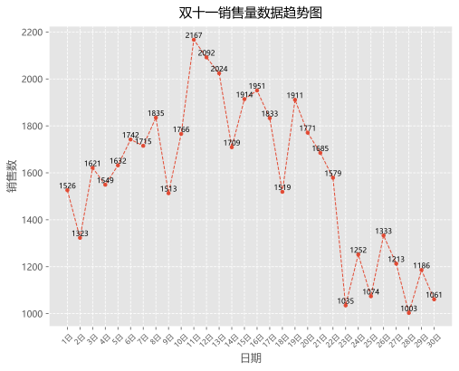
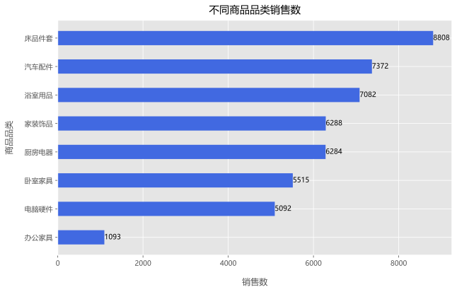
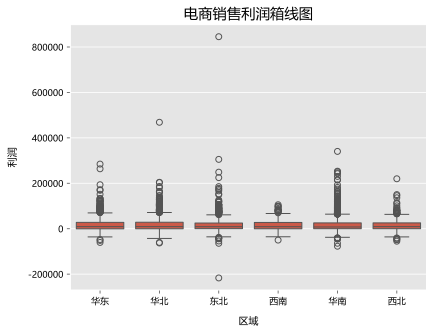
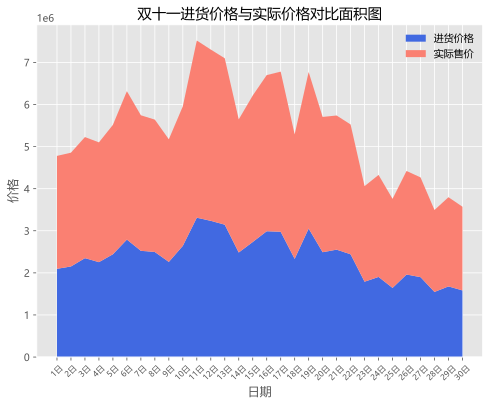
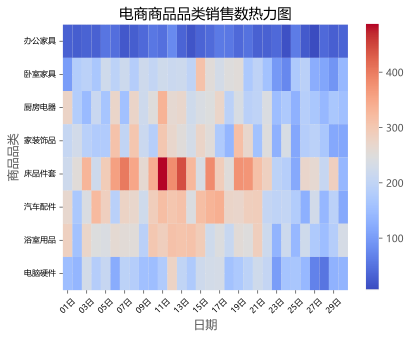

```python
import pandas as pd
import seaborn as sns
import matplotlib.pyplot as plt
import matplotlib.style as psl
```


```python
data = pd.read_excel('电商销售数据.xlsx',
                     parse_dates=['日期'])
```


```python
data.head()
```


<div>
<style scoped>
    .dataframe tbody tr th:only-of-type {
        vertical-align: middle;
    }

    .dataframe tbody tr th {
        vertical-align: top;
    }

    .dataframe thead th {
        text-align: right;
    }
</style>
<table border="1" class="dataframe">
  <thead>
    <tr style="text-align: right;">
      <th></th>
      <th>日期</th>
      <th>订单号</th>
      <th>区域</th>
      <th>客户性别</th>
      <th>客户年龄</th>
      <th>商品品类</th>
      <th>进货价格</th>
      <th>实际售价</th>
      <th>销售数</th>
      <th>销售额</th>
      <th>利润</th>
    </tr>
  </thead>
  <tbody>
    <tr>
      <th>0</th>
      <td>2023-11-01</td>
      <td>10021404488</td>
      <td>华东-上海市-上海</td>
      <td>女</td>
      <td>22</td>
      <td>床品件套</td>
      <td>4150.0</td>
      <td>7090</td>
      <td>11</td>
      <td>77990</td>
      <td>32340</td>
    </tr>
    <tr>
      <th>1</th>
      <td>2023-11-01</td>
      <td>10021344597</td>
      <td>华北-山西省-忻州</td>
      <td>女</td>
      <td>59</td>
      <td>厨房电器</td>
      <td>14000.0</td>
      <td>17220</td>
      <td>6</td>
      <td>103320</td>
      <td>19320</td>
    </tr>
    <tr>
      <th>2</th>
      <td>2023-11-01</td>
      <td>10021531018</td>
      <td>东北-辽宁省-辽阳</td>
      <td>女</td>
      <td>24</td>
      <td>床品件套</td>
      <td>7100.0</td>
      <td>5680</td>
      <td>3</td>
      <td>17040</td>
      <td>-4260</td>
    </tr>
    <tr>
      <th>3</th>
      <td>2023-11-01</td>
      <td>10021583928</td>
      <td>东北-吉林省-松原</td>
      <td>女</td>
      <td>33</td>
      <td>床品件套</td>
      <td>11000.0</td>
      <td>16170</td>
      <td>2</td>
      <td>32340</td>
      <td>10340</td>
    </tr>
    <tr>
      <th>4</th>
      <td>2023-11-01</td>
      <td>10021353159</td>
      <td>西南-四川省-乐山</td>
      <td>女</td>
      <td>34</td>
      <td>床品件套</td>
      <td>8350.0</td>
      <td>11180</td>
      <td>10</td>
      <td>111800</td>
      <td>28300</td>
    </tr>
  </tbody>
</table>
</div>


```python
data.dtypes
```


    日期      datetime64[ns]
    订单号              int64
    区域              object
    客户性别            object
    客户年龄             int64
    商品品类            object
    进货价格            object
    实际售价             int64
    销售数              int64
    销售额              int64
    利润               int64
    dtype: object


```python
data['订单号'] = data['订单号'].astype('str')
```


```python
data.info()
```

    <class 'pandas.core.frame.DataFrame'>
    RangeIndex: 7284 entries, 0 to 7283
    Data columns (total 11 columns):
     #   Column  Non-Null Count  Dtype         
    ---  ------  --------------  -----         
     0   日期      7284 non-null   datetime64[ns]
     1   订单号     7284 non-null   object        
     2   区域      7284 non-null   object        
     3   客户性别    7284 non-null   object        
     4   客户年龄    7284 non-null   int64         
     5   商品品类    7284 non-null   object        
     6   进货价格    7284 non-null   float64       
     7   实际售价    7284 non-null   int64         
     8   销售数     7284 non-null   int64         
     9   销售额     7284 non-null   int64         
     10  利润      7284 non-null   int64         
    dtypes: datetime64[ns](1), float64(1), int64(5), object(4)
    memory usage: 626.1+ KB
    


```python
data['进货价格'] = data['进货价格'].str.extract(r'¥(\d+)').astype('float')
```


```python
data.head()
```


<div>
<style scoped>
    .dataframe tbody tr th:only-of-type {
        vertical-align: middle;
    }

    .dataframe tbody tr th {
        vertical-align: top;
    }

    .dataframe thead th {
        text-align: right;
    }
</style>
<table border="1" class="dataframe">
  <thead>
    <tr style="text-align: right;">
      <th></th>
      <th>日期</th>
      <th>订单号</th>
      <th>区域</th>
      <th>客户性别</th>
      <th>客户年龄</th>
      <th>商品品类</th>
      <th>进货价格</th>
      <th>实际售价</th>
      <th>销售数</th>
      <th>销售额</th>
      <th>利润</th>
    </tr>
  </thead>
  <tbody>
    <tr>
      <th>0</th>
      <td>2023-11-01</td>
      <td>10021404488</td>
      <td>华东-上海市-上海</td>
      <td>女</td>
      <td>22</td>
      <td>床品件套</td>
      <td>4150.0</td>
      <td>7090</td>
      <td>11</td>
      <td>77990</td>
      <td>32340</td>
    </tr>
    <tr>
      <th>1</th>
      <td>2023-11-01</td>
      <td>10021344597</td>
      <td>华北-山西省-忻州</td>
      <td>女</td>
      <td>59</td>
      <td>厨房电器</td>
      <td>14000.0</td>
      <td>17220</td>
      <td>6</td>
      <td>103320</td>
      <td>19320</td>
    </tr>
    <tr>
      <th>2</th>
      <td>2023-11-01</td>
      <td>10021531018</td>
      <td>东北-辽宁省-辽阳</td>
      <td>女</td>
      <td>24</td>
      <td>床品件套</td>
      <td>7100.0</td>
      <td>5680</td>
      <td>3</td>
      <td>17040</td>
      <td>-4260</td>
    </tr>
    <tr>
      <th>3</th>
      <td>2023-11-01</td>
      <td>10021583928</td>
      <td>东北-吉林省-松原</td>
      <td>女</td>
      <td>33</td>
      <td>床品件套</td>
      <td>11000.0</td>
      <td>16170</td>
      <td>2</td>
      <td>32340</td>
      <td>10340</td>
    </tr>
    <tr>
      <th>4</th>
      <td>2023-11-01</td>
      <td>10021353159</td>
      <td>西南-四川省-乐山</td>
      <td>女</td>
      <td>34</td>
      <td>床品件套</td>
      <td>8350.0</td>
      <td>11180</td>
      <td>10</td>
      <td>111800</td>
      <td>28300</td>
    </tr>
  </tbody>
</table>
</div>


```python
df_split = data['区域'].str.split('-', expand=True)
df_split
```


<div>
<style scoped>
    .dataframe tbody tr th:only-of-type {
        vertical-align: middle;
    }

    .dataframe tbody tr th {
        vertical-align: top;
    }

    .dataframe thead th {
        text-align: right;
    }
</style>
<table border="1" class="dataframe">
  <thead>
    <tr style="text-align: right;">
      <th></th>
      <th>0</th>
      <th>1</th>
      <th>2</th>
    </tr>
  </thead>
  <tbody>
    <tr>
      <th>0</th>
      <td>华东</td>
      <td>上海市</td>
      <td>上海</td>
    </tr>
    <tr>
      <th>1</th>
      <td>华北</td>
      <td>山西省</td>
      <td>忻州</td>
    </tr>
    <tr>
      <th>2</th>
      <td>东北</td>
      <td>辽宁省</td>
      <td>辽阳</td>
    </tr>
    <tr>
      <th>3</th>
      <td>东北</td>
      <td>吉林省</td>
      <td>松原</td>
    </tr>
    <tr>
      <th>4</th>
      <td>西南</td>
      <td>四川省</td>
      <td>乐山</td>
    </tr>
    <tr>
      <th>...</th>
      <td>...</td>
      <td>...</td>
      <td>...</td>
    </tr>
    <tr>
      <th>7279</th>
      <td>东北</td>
      <td>辽宁省</td>
      <td>本溪</td>
    </tr>
    <tr>
      <th>7280</th>
      <td>西北</td>
      <td>甘肃省</td>
      <td>嘉峪关</td>
    </tr>
    <tr>
      <th>7281</th>
      <td>华东</td>
      <td>浙江省</td>
      <td>湖州</td>
    </tr>
    <tr>
      <th>7282</th>
      <td>华东</td>
      <td>山东省</td>
      <td>济南</td>
    </tr>
    <tr>
      <th>7283</th>
      <td>华东</td>
      <td>福建省</td>
      <td>厦门</td>
    </tr>
  </tbody>
</table>
<p>7284 rows × 3 columns</p>
</div>


```python
data['区域'] = df_split.iloc[:, 0]
data['省份'] = df_split.iloc[:, 1]
data['城市'] = df_split.iloc[:, 2]
data.head()
```


<div>
<style scoped>
    .dataframe tbody tr th:only-of-type {
        vertical-align: middle;
    }

    .dataframe tbody tr th {
        vertical-align: top;
    }

    .dataframe thead th {
        text-align: right;
    }
</style>
<table border="1" class="dataframe">
  <thead>
    <tr style="text-align: right;">
      <th></th>
      <th>日期</th>
      <th>订单号</th>
      <th>区域</th>
      <th>客户性别</th>
      <th>客户年龄</th>
      <th>商品品类</th>
      <th>进货价格</th>
      <th>实际售价</th>
      <th>销售数</th>
      <th>销售额</th>
      <th>利润</th>
      <th>省份</th>
      <th>城市</th>
    </tr>
  </thead>
  <tbody>
    <tr>
      <th>0</th>
      <td>2023-11-01</td>
      <td>10021404488</td>
      <td>华东</td>
      <td>女</td>
      <td>22</td>
      <td>床品件套</td>
      <td>4150.0</td>
      <td>7090</td>
      <td>11</td>
      <td>77990</td>
      <td>32340</td>
      <td>上海市</td>
      <td>上海</td>
    </tr>
    <tr>
      <th>1</th>
      <td>2023-11-01</td>
      <td>10021344597</td>
      <td>华北</td>
      <td>女</td>
      <td>59</td>
      <td>厨房电器</td>
      <td>14000.0</td>
      <td>17220</td>
      <td>6</td>
      <td>103320</td>
      <td>19320</td>
      <td>山西省</td>
      <td>忻州</td>
    </tr>
    <tr>
      <th>2</th>
      <td>2023-11-01</td>
      <td>10021531018</td>
      <td>东北</td>
      <td>女</td>
      <td>24</td>
      <td>床品件套</td>
      <td>7100.0</td>
      <td>5680</td>
      <td>3</td>
      <td>17040</td>
      <td>-4260</td>
      <td>辽宁省</td>
      <td>辽阳</td>
    </tr>
    <tr>
      <th>3</th>
      <td>2023-11-01</td>
      <td>10021583928</td>
      <td>东北</td>
      <td>女</td>
      <td>33</td>
      <td>床品件套</td>
      <td>11000.0</td>
      <td>16170</td>
      <td>2</td>
      <td>32340</td>
      <td>10340</td>
      <td>吉林省</td>
      <td>松原</td>
    </tr>
    <tr>
      <th>4</th>
      <td>2023-11-01</td>
      <td>10021353159</td>
      <td>西南</td>
      <td>女</td>
      <td>34</td>
      <td>床品件套</td>
      <td>8350.0</td>
      <td>11180</td>
      <td>10</td>
      <td>111800</td>
      <td>28300</td>
      <td>四川省</td>
      <td>乐山</td>
    </tr>
  </tbody>
</table>
</div>


```python
%matplotlib inline 
%config InlineBackend.figure_format = 'svg' 

plt.rcParams["font.sans-serif"] = 'Microsoft YaHei' 
plt.rcParams['axes.unicode_minus'] = False 

psl.use('ggplot')
```


```python
df_sale_date = data.groupby('日期')['销售数'].sum().reset_index()
df_sale_date.head()
```


<div>
<style scoped>
    .dataframe tbody tr th:only-of-type {
        vertical-align: middle;
    }

    .dataframe tbody tr th {
        vertical-align: top;
    }

    .dataframe thead th {
        text-align: right;
    }
</style>
<table border="1" class="dataframe">
  <thead>
    <tr style="text-align: right;">
      <th></th>
      <th>日期</th>
      <th>销售数</th>
    </tr>
  </thead>
  <tbody>
    <tr>
      <th>0</th>
      <td>2023-11-01</td>
      <td>1526</td>
    </tr>
    <tr>
      <th>1</th>
      <td>2023-11-02</td>
      <td>1323</td>
    </tr>
    <tr>
      <th>2</th>
      <td>2023-11-03</td>
      <td>1621</td>
    </tr>
    <tr>
      <th>3</th>
      <td>2023-11-04</td>
      <td>1549</td>
    </tr>
    <tr>
      <th>4</th>
      <td>2023-11-05</td>
      <td>1632</td>
    </tr>
  </tbody>
</table>
</div>


```python
plt.figure(figsize=(8, 6))
plt.plot(df_sale_date['日期'], df_sale_date['销售数'],
         marker='o', markersize=3.5, linestyle='--', linewidth=1)
plt.xlabel('日期')
plt.ylabel('销售数')
plt.title('双十一销售量数据趋势图', pad=10)
plt.xticks(df_sale_date['日期'], [f'{i}日' for i in range(1, 31)], rotation=45, fontsize=8)
plt.grid(linestyle='--')
for a, b in zip(df_sale_date['日期'], df_sale_date['销售数']):
    plt.text(a, b, b, ha='center', va='bottom', fontsize=8)
plt.savefig('双十一销售量数据趋势图.svg')
plt.show()
```


    

    


```python
data.head()
```


<div>
<style scoped>
    .dataframe tbody tr th:only-of-type {
        vertical-align: middle;
    }

    .dataframe tbody tr th {
        vertical-align: top;
    }

    .dataframe thead th {
        text-align: right;
    }
</style>
<table border="1" class="dataframe">
  <thead>
    <tr style="text-align: right;">
      <th></th>
      <th>日期</th>
      <th>订单号</th>
      <th>区域</th>
      <th>客户性别</th>
      <th>客户年龄</th>
      <th>商品品类</th>
      <th>进货价格</th>
      <th>实际售价</th>
      <th>销售数</th>
      <th>销售额</th>
      <th>利润</th>
      <th>省份</th>
      <th>城市</th>
    </tr>
  </thead>
  <tbody>
    <tr>
      <th>0</th>
      <td>2023-11-01</td>
      <td>10021404488</td>
      <td>华东</td>
      <td>女</td>
      <td>22</td>
      <td>床品件套</td>
      <td>4150.0</td>
      <td>7090</td>
      <td>11</td>
      <td>77990</td>
      <td>32340</td>
      <td>上海市</td>
      <td>上海</td>
    </tr>
    <tr>
      <th>1</th>
      <td>2023-11-01</td>
      <td>10021344597</td>
      <td>华北</td>
      <td>女</td>
      <td>59</td>
      <td>厨房电器</td>
      <td>14000.0</td>
      <td>17220</td>
      <td>6</td>
      <td>103320</td>
      <td>19320</td>
      <td>山西省</td>
      <td>忻州</td>
    </tr>
    <tr>
      <th>2</th>
      <td>2023-11-01</td>
      <td>10021531018</td>
      <td>东北</td>
      <td>女</td>
      <td>24</td>
      <td>床品件套</td>
      <td>7100.0</td>
      <td>5680</td>
      <td>3</td>
      <td>17040</td>
      <td>-4260</td>
      <td>辽宁省</td>
      <td>辽阳</td>
    </tr>
    <tr>
      <th>3</th>
      <td>2023-11-01</td>
      <td>10021583928</td>
      <td>东北</td>
      <td>女</td>
      <td>33</td>
      <td>床品件套</td>
      <td>11000.0</td>
      <td>16170</td>
      <td>2</td>
      <td>32340</td>
      <td>10340</td>
      <td>吉林省</td>
      <td>松原</td>
    </tr>
    <tr>
      <th>4</th>
      <td>2023-11-01</td>
      <td>10021353159</td>
      <td>西南</td>
      <td>女</td>
      <td>34</td>
      <td>床品件套</td>
      <td>8350.0</td>
      <td>11180</td>
      <td>10</td>
      <td>111800</td>
      <td>28300</td>
      <td>四川省</td>
      <td>乐山</td>
    </tr>
  </tbody>
</table>
</div>


```python
df_sale_class = data.groupby('商品品类')['销售数'].sum().sort_values().reset_index()
df_sale_class
```


<div>
<style scoped>
    .dataframe tbody tr th:only-of-type {
        vertical-align: middle;
    }

    .dataframe tbody tr th {
        vertical-align: top;
    }

    .dataframe thead th {
        text-align: right;
    }
</style>
<table border="1" class="dataframe">
  <thead>
    <tr style="text-align: right;">
      <th></th>
      <th>商品品类</th>
      <th>销售数</th>
    </tr>
  </thead>
  <tbody>
    <tr>
      <th>0</th>
      <td>办公家具</td>
      <td>1093</td>
    </tr>
    <tr>
      <th>1</th>
      <td>电脑硬件</td>
      <td>5092</td>
    </tr>
    <tr>
      <th>2</th>
      <td>卧室家具</td>
      <td>5515</td>
    </tr>
    <tr>
      <th>3</th>
      <td>厨房电器</td>
      <td>6284</td>
    </tr>
    <tr>
      <th>4</th>
      <td>家装饰品</td>
      <td>6288</td>
    </tr>
    <tr>
      <th>5</th>
      <td>浴室用品</td>
      <td>7082</td>
    </tr>
    <tr>
      <th>6</th>
      <td>汽车配件</td>
      <td>7372</td>
    </tr>
    <tr>
      <th>7</th>
      <td>床品件套</td>
      <td>8808</td>
    </tr>
  </tbody>
</table>
</div>


```python
plt.figure(figsize=(10, 6))
plt.barh(df_sale_class['商品品类'], df_sale_class['销售数'], height=0.5, color='royalblue')
plt.xlabel('销售数', labelpad=15)
plt.ylabel('商品品类', labelpad=15)
plt.title('不同商品品类销售数', pad=10)
for a, b in zip(df_sale_class['商品品类'], df_sale_class['销售数']):
    plt.text(b, a, b, ha='left', va='center', fontsize=10)
plt.savefig('不同商品品类销售数.svg')
plt.show()
```


    <Figure size 640x480 with 0 Axes>


    

    


```python
sns.boxplot(data=data, x=data['区域'], y=data['利润'])
plt.xticks(fontsize=9, color='k')
plt.yticks(fontsize=9, color='k')
plt.xlabel('区域', labelpad=10, fontsize=10, color='k')
plt.ylabel('利润', labelpad=10, fontsize=10, color='k')
plt.title('电商销售利润箱线图')
plt.show()
```


    

    


```python
df_sale_cost = data.groupby('日期')[['进货价格', '实际售价']].sum().reset_index()
df_sale_cost.head()
```


<div>
<style scoped>
    .dataframe tbody tr th:only-of-type {
        vertical-align: middle;
    }

    .dataframe tbody tr th {
        vertical-align: top;
    }

    .dataframe thead th {
        text-align: right;
    }
</style>
<table border="1" class="dataframe">
  <thead>
    <tr style="text-align: right;">
      <th></th>
      <th>日期</th>
      <th>进货价格</th>
      <th>实际售价</th>
    </tr>
  </thead>
  <tbody>
    <tr>
      <th>0</th>
      <td>2023-11-01</td>
      <td>2095850.0</td>
      <td>2682560</td>
    </tr>
    <tr>
      <th>1</th>
      <td>2023-11-02</td>
      <td>2152600.0</td>
      <td>2702740</td>
    </tr>
    <tr>
      <th>2</th>
      <td>2023-11-03</td>
      <td>2349500.0</td>
      <td>2876330</td>
    </tr>
    <tr>
      <th>3</th>
      <td>2023-11-04</td>
      <td>2254300.0</td>
      <td>2845310</td>
    </tr>
    <tr>
      <th>4</th>
      <td>2023-11-05</td>
      <td>2442000.0</td>
      <td>3073570</td>
    </tr>
  </tbody>
</table>
</div>


```python
x = df_sale_cost['日期'].tolist()
y1 = df_sale_cost['进货价格'].tolist()
y2 = df_sale_cost['实际售价'].tolist()
```


```python
plt.figure(figsize=(8, 6))
plt.stackplot(x, y1, y2, labels=['进货价格', '实际售价'], colors=['royalblue', 'salmon'])
plt.xlabel('日期')
plt.ylabel('价格')
plt.title('双十一进货价格与实际价格对比面积图')
plt.xticks(x, [f'{i}日' for i in range(1, 31)], rotation=45, fontsize=8)
plt.legend(frameon=False)
plt.show()
```


    

    


```python
data['日'] = data['日期'].dt.strftime('%d日')
```


```python
df_group = data.pivot_table(values='销售数', index='商品品类', columns='日', aggfunc='sum')
```


```python
sns.heatmap(df_group, cmap='coolwarm')
plt.xlabel('日期')
plt.xticks(rotation=45, fontsize=8, color='k')
plt.yticks(fontsize=8, color='k')
plt.title('电商商品品类销售数热力图')
plt.savefig('电商商品品类销售数热力图.svg')
plt.show()
```


    

    


```python

```
