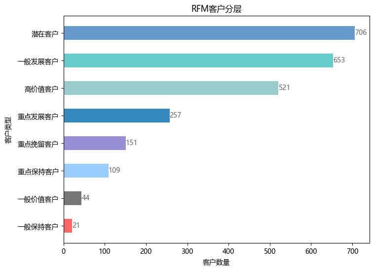

```python
%%time
import pandas as pd
import numpy as np
import matplotlib.pyplot as plt
```

    CPU times: total: 3.98 s
    Wall time: 4.23 s
    


```python
data = pd.read_csv('用户下单数据.csv',
                   engine='python',
                   encoding='gbk')
```


```python
data.head()
```


<div>
<style scoped>
    .dataframe tbody tr th:only-of-type {
        vertical-align: middle;
    }

    .dataframe tbody tr th {
        vertical-align: top;
    }

    .dataframe thead th {
        text-align: right;
    }
</style>
<table border="1" class="dataframe">
  <thead>
    <tr style="text-align: right;">
      <th></th>
      <th>用户ID</th>
      <th>用户出生日期</th>
      <th>性别</th>
      <th>婚姻状况</th>
      <th>文化程度</th>
      <th>下单时间</th>
      <th>订单ID</th>
      <th>交易金额</th>
    </tr>
  </thead>
  <tbody>
    <tr>
      <th>0</th>
      <td>6414111</td>
      <td>1991/8/24</td>
      <td>男</td>
      <td>已婚</td>
      <td>本科</td>
      <td>2020/1/1 17:41</td>
      <td>1000595826</td>
      <td>402.765811</td>
    </tr>
    <tr>
      <th>1</th>
      <td>6516117</td>
      <td>1983/7/21</td>
      <td>女</td>
      <td>已婚</td>
      <td>博士</td>
      <td>2021/10/15 22:47</td>
      <td>1000610643</td>
      <td>545.273062</td>
    </tr>
    <tr>
      <th>2</th>
      <td>6714112</td>
      <td>1986/6/21</td>
      <td>女</td>
      <td>已婚</td>
      <td>博士</td>
      <td>2020/11/22 09:45</td>
      <td>1001934364</td>
      <td>256.716973</td>
    </tr>
    <tr>
      <th>3</th>
      <td>5311117</td>
      <td>1978/5/25</td>
      <td>女</td>
      <td>未婚</td>
      <td>大专</td>
      <td>2021/3/26 11:53</td>
      <td>1007749907</td>
      <td>275.547080</td>
    </tr>
    <tr>
      <th>4</th>
      <td>4316113</td>
      <td>1979/8/1</td>
      <td>男</td>
      <td>未婚</td>
      <td>大专</td>
      <td>2021/7/10 18:59</td>
      <td>1007770144</td>
      <td>1023.500156</td>
    </tr>
  </tbody>
</table>
</div>


```python
data.info()
```

    <class 'pandas.core.frame.DataFrame'>
    RangeIndex: 5000 entries, 0 to 4999
    Data columns (total 8 columns):
     #   Column  Non-Null Count  Dtype  
    ---  ------  --------------  -----  
     0   用户ID    5000 non-null   object 
     1   用户出生日期  5000 non-null   object 
     2   性别      5000 non-null   object 
     3   婚姻状况    5000 non-null   object 
     4   文化程度    5000 non-null   object 
     5   下单时间    5000 non-null   object 
     6   订单ID    5000 non-null   object 
     7   交易金额    5000 non-null   float64
    dtypes: float64(1), object(7)
    memory usage: 312.6+ KB
    


```python
data['用户ID'] = data['用户ID'].astype('str')
data['订单ID'] = data['订单ID'].astype('str')
data['下单时间'] = pd.to_datetime(data['下单时间'], format='%Y/%m/%d %H:%M')
data['间隔天数'] = (pd.to_datetime('2025/4/21') - data['下单时间']).dt.days
```


```python
R = data.groupby('用户ID')['间隔天数'].min().reset_index()
R
```


<div>
<style scoped>
    .dataframe tbody tr th:only-of-type {
        vertical-align: middle;
    }

    .dataframe tbody tr th {
        vertical-align: top;
    }

    .dataframe thead th {
        text-align: right;
    }
</style>
<table border="1" class="dataframe">
  <thead>
    <tr style="text-align: right;">
      <th></th>
      <th>用户ID</th>
      <th>间隔天数</th>
    </tr>
  </thead>
  <tbody>
    <tr>
      <th>0</th>
      <td>3211111</td>
      <td>916</td>
    </tr>
    <tr>
      <th>1</th>
      <td>3211114</td>
      <td>753</td>
    </tr>
    <tr>
      <th>2</th>
      <td>3211115</td>
      <td>762</td>
    </tr>
    <tr>
      <th>3</th>
      <td>3211117</td>
      <td>792</td>
    </tr>
    <tr>
      <th>4</th>
      <td>3211118</td>
      <td>881</td>
    </tr>
    <tr>
      <th>...</th>
      <td>...</td>
      <td>...</td>
    </tr>
    <tr>
      <th>2457</th>
      <td>6720113</td>
      <td>1400</td>
    </tr>
    <tr>
      <th>2458</th>
      <td>6720114</td>
      <td>737</td>
    </tr>
    <tr>
      <th>2459</th>
      <td>6720115</td>
      <td>849</td>
    </tr>
    <tr>
      <th>2460</th>
      <td>6720119</td>
      <td>1051</td>
    </tr>
    <tr>
      <th>2461</th>
      <td>6720120</td>
      <td>772</td>
    </tr>
  </tbody>
</table>
<p>2462 rows × 2 columns</p>
</div>


```python
F = data.groupby('用户ID')['订单ID'].count().reset_index()
F
```


<div>
<style scoped>
    .dataframe tbody tr th:only-of-type {
        vertical-align: middle;
    }

    .dataframe tbody tr th {
        vertical-align: top;
    }

    .dataframe thead th {
        text-align: right;
    }
</style>
<table border="1" class="dataframe">
  <thead>
    <tr style="text-align: right;">
      <th></th>
      <th>用户ID</th>
      <th>订单ID</th>
    </tr>
  </thead>
  <tbody>
    <tr>
      <th>0</th>
      <td>3211111</td>
      <td>1</td>
    </tr>
    <tr>
      <th>1</th>
      <td>3211114</td>
      <td>1</td>
    </tr>
    <tr>
      <th>2</th>
      <td>3211115</td>
      <td>2</td>
    </tr>
    <tr>
      <th>3</th>
      <td>3211117</td>
      <td>1</td>
    </tr>
    <tr>
      <th>4</th>
      <td>3211118</td>
      <td>1</td>
    </tr>
    <tr>
      <th>...</th>
      <td>...</td>
      <td>...</td>
    </tr>
    <tr>
      <th>2457</th>
      <td>6720113</td>
      <td>1</td>
    </tr>
    <tr>
      <th>2458</th>
      <td>6720114</td>
      <td>5</td>
    </tr>
    <tr>
      <th>2459</th>
      <td>6720115</td>
      <td>6</td>
    </tr>
    <tr>
      <th>2460</th>
      <td>6720119</td>
      <td>1</td>
    </tr>
    <tr>
      <th>2461</th>
      <td>6720120</td>
      <td>2</td>
    </tr>
  </tbody>
</table>
<p>2462 rows × 2 columns</p>
</div>


```python
M = data.groupby('用户ID')['交易金额'].sum().reset_index()
M
```


<div>
<style scoped>
    .dataframe tbody tr th:only-of-type {
        vertical-align: middle;
    }

    .dataframe tbody tr th {
        vertical-align: top;
    }

    .dataframe thead th {
        text-align: right;
    }
</style>
<table border="1" class="dataframe">
  <thead>
    <tr style="text-align: right;">
      <th></th>
      <th>用户ID</th>
      <th>交易金额</th>
    </tr>
  </thead>
  <tbody>
    <tr>
      <th>0</th>
      <td>3211111</td>
      <td>590.091338</td>
    </tr>
    <tr>
      <th>1</th>
      <td>3211114</td>
      <td>505.748788</td>
    </tr>
    <tr>
      <th>2</th>
      <td>3211115</td>
      <td>1008.014778</td>
    </tr>
    <tr>
      <th>3</th>
      <td>3211117</td>
      <td>918.527138</td>
    </tr>
    <tr>
      <th>4</th>
      <td>3211118</td>
      <td>699.088746</td>
    </tr>
    <tr>
      <th>...</th>
      <td>...</td>
      <td>...</td>
    </tr>
    <tr>
      <th>2457</th>
      <td>6720113</td>
      <td>374.155492</td>
    </tr>
    <tr>
      <th>2458</th>
      <td>6720114</td>
      <td>2720.553608</td>
    </tr>
    <tr>
      <th>2459</th>
      <td>6720115</td>
      <td>3165.949017</td>
    </tr>
    <tr>
      <th>2460</th>
      <td>6720119</td>
      <td>324.532206</td>
    </tr>
    <tr>
      <th>2461</th>
      <td>6720120</td>
      <td>1435.895783</td>
    </tr>
  </tbody>
</table>
<p>2462 rows × 2 columns</p>
</div>


```python
RFM = R.merge(F, on='用户ID').merge(M, on='用户ID')
RFM
```


<div>
<style scoped>
    .dataframe tbody tr th:only-of-type {
        vertical-align: middle;
    }

    .dataframe tbody tr th {
        vertical-align: top;
    }

    .dataframe thead th {
        text-align: right;
    }
</style>
<table border="1" class="dataframe">
  <thead>
    <tr style="text-align: right;">
      <th></th>
      <th>用户ID</th>
      <th>间隔天数</th>
      <th>订单ID</th>
      <th>交易金额</th>
    </tr>
  </thead>
  <tbody>
    <tr>
      <th>0</th>
      <td>3211111</td>
      <td>916</td>
      <td>1</td>
      <td>590.091338</td>
    </tr>
    <tr>
      <th>1</th>
      <td>3211114</td>
      <td>753</td>
      <td>1</td>
      <td>505.748788</td>
    </tr>
    <tr>
      <th>2</th>
      <td>3211115</td>
      <td>762</td>
      <td>2</td>
      <td>1008.014778</td>
    </tr>
    <tr>
      <th>3</th>
      <td>3211117</td>
      <td>792</td>
      <td>1</td>
      <td>918.527138</td>
    </tr>
    <tr>
      <th>4</th>
      <td>3211118</td>
      <td>881</td>
      <td>1</td>
      <td>699.088746</td>
    </tr>
    <tr>
      <th>...</th>
      <td>...</td>
      <td>...</td>
      <td>...</td>
      <td>...</td>
    </tr>
    <tr>
      <th>2457</th>
      <td>6720113</td>
      <td>1400</td>
      <td>1</td>
      <td>374.155492</td>
    </tr>
    <tr>
      <th>2458</th>
      <td>6720114</td>
      <td>737</td>
      <td>5</td>
      <td>2720.553608</td>
    </tr>
    <tr>
      <th>2459</th>
      <td>6720115</td>
      <td>849</td>
      <td>6</td>
      <td>3165.949017</td>
    </tr>
    <tr>
      <th>2460</th>
      <td>6720119</td>
      <td>1051</td>
      <td>1</td>
      <td>324.532206</td>
    </tr>
    <tr>
      <th>2461</th>
      <td>6720120</td>
      <td>772</td>
      <td>2</td>
      <td>1435.895783</td>
    </tr>
  </tbody>
</table>
<p>2462 rows × 4 columns</p>
</div>


```python
RFM.rename(columns={'间隔天数': 'R', '订单ID': 'F', '交易金额': 'M'}, inplace=True)
RFM
```


<div>
<style scoped>
    .dataframe tbody tr th:only-of-type {
        vertical-align: middle;
    }

    .dataframe tbody tr th {
        vertical-align: top;
    }

    .dataframe thead th {
        text-align: right;
    }
</style>
<table border="1" class="dataframe">
  <thead>
    <tr style="text-align: right;">
      <th></th>
      <th>用户ID</th>
      <th>R</th>
      <th>F</th>
      <th>M</th>
    </tr>
  </thead>
  <tbody>
    <tr>
      <th>0</th>
      <td>3211111</td>
      <td>916</td>
      <td>1</td>
      <td>590.091338</td>
    </tr>
    <tr>
      <th>1</th>
      <td>3211114</td>
      <td>753</td>
      <td>1</td>
      <td>505.748788</td>
    </tr>
    <tr>
      <th>2</th>
      <td>3211115</td>
      <td>762</td>
      <td>2</td>
      <td>1008.014778</td>
    </tr>
    <tr>
      <th>3</th>
      <td>3211117</td>
      <td>792</td>
      <td>1</td>
      <td>918.527138</td>
    </tr>
    <tr>
      <th>4</th>
      <td>3211118</td>
      <td>881</td>
      <td>1</td>
      <td>699.088746</td>
    </tr>
    <tr>
      <th>...</th>
      <td>...</td>
      <td>...</td>
      <td>...</td>
      <td>...</td>
    </tr>
    <tr>
      <th>2457</th>
      <td>6720113</td>
      <td>1400</td>
      <td>1</td>
      <td>374.155492</td>
    </tr>
    <tr>
      <th>2458</th>
      <td>6720114</td>
      <td>737</td>
      <td>5</td>
      <td>2720.553608</td>
    </tr>
    <tr>
      <th>2459</th>
      <td>6720115</td>
      <td>849</td>
      <td>6</td>
      <td>3165.949017</td>
    </tr>
    <tr>
      <th>2460</th>
      <td>6720119</td>
      <td>1051</td>
      <td>1</td>
      <td>324.532206</td>
    </tr>
    <tr>
      <th>2461</th>
      <td>6720120</td>
      <td>772</td>
      <td>2</td>
      <td>1435.895783</td>
    </tr>
  </tbody>
</table>
<p>2462 rows × 4 columns</p>
</div>


```python
RFM['R_score'] = np.where(RFM['R'] < RFM['R'].mean(), 2, 1)
RFM['F_score'] = np.where(RFM['F'] >= RFM['F'].mean(), 2, 1)
RFM['M_score'] = np.where(RFM['M'] >= RFM['M'].mean(), 2, 1)
RFM
```


<div>
<style scoped>
    .dataframe tbody tr th:only-of-type {
        vertical-align: middle;
    }

    .dataframe tbody tr th {
        vertical-align: top;
    }

    .dataframe thead th {
        text-align: right;
    }
</style>
<table border="1" class="dataframe">
  <thead>
    <tr style="text-align: right;">
      <th></th>
      <th>用户ID</th>
      <th>R</th>
      <th>F</th>
      <th>M</th>
      <th>R_score</th>
      <th>F_score</th>
      <th>M_score</th>
    </tr>
  </thead>
  <tbody>
    <tr>
      <th>0</th>
      <td>3211111</td>
      <td>916</td>
      <td>1</td>
      <td>590.091338</td>
      <td>2</td>
      <td>1</td>
      <td>1</td>
    </tr>
    <tr>
      <th>1</th>
      <td>3211114</td>
      <td>753</td>
      <td>1</td>
      <td>505.748788</td>
      <td>2</td>
      <td>1</td>
      <td>1</td>
    </tr>
    <tr>
      <th>2</th>
      <td>3211115</td>
      <td>762</td>
      <td>2</td>
      <td>1008.014778</td>
      <td>2</td>
      <td>1</td>
      <td>1</td>
    </tr>
    <tr>
      <th>3</th>
      <td>3211117</td>
      <td>792</td>
      <td>1</td>
      <td>918.527138</td>
      <td>2</td>
      <td>1</td>
      <td>1</td>
    </tr>
    <tr>
      <th>4</th>
      <td>3211118</td>
      <td>881</td>
      <td>1</td>
      <td>699.088746</td>
      <td>2</td>
      <td>1</td>
      <td>1</td>
    </tr>
    <tr>
      <th>...</th>
      <td>...</td>
      <td>...</td>
      <td>...</td>
      <td>...</td>
      <td>...</td>
      <td>...</td>
      <td>...</td>
    </tr>
    <tr>
      <th>2457</th>
      <td>6720113</td>
      <td>1400</td>
      <td>1</td>
      <td>374.155492</td>
      <td>1</td>
      <td>1</td>
      <td>1</td>
    </tr>
    <tr>
      <th>2458</th>
      <td>6720114</td>
      <td>737</td>
      <td>5</td>
      <td>2720.553608</td>
      <td>2</td>
      <td>2</td>
      <td>2</td>
    </tr>
    <tr>
      <th>2459</th>
      <td>6720115</td>
      <td>849</td>
      <td>6</td>
      <td>3165.949017</td>
      <td>2</td>
      <td>2</td>
      <td>2</td>
    </tr>
    <tr>
      <th>2460</th>
      <td>6720119</td>
      <td>1051</td>
      <td>1</td>
      <td>324.532206</td>
      <td>2</td>
      <td>1</td>
      <td>1</td>
    </tr>
    <tr>
      <th>2461</th>
      <td>6720120</td>
      <td>772</td>
      <td>2</td>
      <td>1435.895783</td>
      <td>2</td>
      <td>1</td>
      <td>2</td>
    </tr>
  </tbody>
</table>
<p>2462 rows × 7 columns</p>
</div>


```python
RFM['RFM'] = RFM['R_score'] * 100 + RFM['F_score'] * 10 + RFM['M_score']
RFM
```


<div>
<style scoped>
    .dataframe tbody tr th:only-of-type {
        vertical-align: middle;
    }

    .dataframe tbody tr th {
        vertical-align: top;
    }

    .dataframe thead th {
        text-align: right;
    }
</style>
<table border="1" class="dataframe">
  <thead>
    <tr style="text-align: right;">
      <th></th>
      <th>用户ID</th>
      <th>R</th>
      <th>F</th>
      <th>M</th>
      <th>R_score</th>
      <th>F_score</th>
      <th>M_score</th>
      <th>RFM</th>
    </tr>
  </thead>
  <tbody>
    <tr>
      <th>0</th>
      <td>3211111</td>
      <td>916</td>
      <td>1</td>
      <td>590.091338</td>
      <td>2</td>
      <td>1</td>
      <td>1</td>
      <td>211</td>
    </tr>
    <tr>
      <th>1</th>
      <td>3211114</td>
      <td>753</td>
      <td>1</td>
      <td>505.748788</td>
      <td>2</td>
      <td>1</td>
      <td>1</td>
      <td>211</td>
    </tr>
    <tr>
      <th>2</th>
      <td>3211115</td>
      <td>762</td>
      <td>2</td>
      <td>1008.014778</td>
      <td>2</td>
      <td>1</td>
      <td>1</td>
      <td>211</td>
    </tr>
    <tr>
      <th>3</th>
      <td>3211117</td>
      <td>792</td>
      <td>1</td>
      <td>918.527138</td>
      <td>2</td>
      <td>1</td>
      <td>1</td>
      <td>211</td>
    </tr>
    <tr>
      <th>4</th>
      <td>3211118</td>
      <td>881</td>
      <td>1</td>
      <td>699.088746</td>
      <td>2</td>
      <td>1</td>
      <td>1</td>
      <td>211</td>
    </tr>
    <tr>
      <th>...</th>
      <td>...</td>
      <td>...</td>
      <td>...</td>
      <td>...</td>
      <td>...</td>
      <td>...</td>
      <td>...</td>
      <td>...</td>
    </tr>
    <tr>
      <th>2457</th>
      <td>6720113</td>
      <td>1400</td>
      <td>1</td>
      <td>374.155492</td>
      <td>1</td>
      <td>1</td>
      <td>1</td>
      <td>111</td>
    </tr>
    <tr>
      <th>2458</th>
      <td>6720114</td>
      <td>737</td>
      <td>5</td>
      <td>2720.553608</td>
      <td>2</td>
      <td>2</td>
      <td>2</td>
      <td>222</td>
    </tr>
    <tr>
      <th>2459</th>
      <td>6720115</td>
      <td>849</td>
      <td>6</td>
      <td>3165.949017</td>
      <td>2</td>
      <td>2</td>
      <td>2</td>
      <td>222</td>
    </tr>
    <tr>
      <th>2460</th>
      <td>6720119</td>
      <td>1051</td>
      <td>1</td>
      <td>324.532206</td>
      <td>2</td>
      <td>1</td>
      <td>1</td>
      <td>211</td>
    </tr>
    <tr>
      <th>2461</th>
      <td>6720120</td>
      <td>772</td>
      <td>2</td>
      <td>1435.895783</td>
      <td>2</td>
      <td>1</td>
      <td>2</td>
      <td>212</td>
    </tr>
  </tbody>
</table>
<p>2462 rows × 8 columns</p>
</div>


```python
customer_type = pd.DataFrame(data={'RFM': [111, 112, 121, 122, 211, 212, 221, 222],
                                   'Type': ['潜在客户', '重点挽留客户', '一般保持客户',' 重点保持客户',
                                           '一般发展客户', '重点发展客户', '一般价值客户', '高价值客户']})
```


```python
RFM = RFM.merge(customer_type, on='RFM')
RFM
```


<div>
<style scoped>
    .dataframe tbody tr th:only-of-type {
        vertical-align: middle;
    }

    .dataframe tbody tr th {
        vertical-align: top;
    }

    .dataframe thead th {
        text-align: right;
    }
</style>
<table border="1" class="dataframe">
  <thead>
    <tr style="text-align: right;">
      <th></th>
      <th>用户ID</th>
      <th>R</th>
      <th>F</th>
      <th>M</th>
      <th>R_score</th>
      <th>F_score</th>
      <th>M_score</th>
      <th>RFM</th>
      <th>Type</th>
    </tr>
  </thead>
  <tbody>
    <tr>
      <th>0</th>
      <td>3211111</td>
      <td>916</td>
      <td>1</td>
      <td>590.091338</td>
      <td>2</td>
      <td>1</td>
      <td>1</td>
      <td>211</td>
      <td>一般发展客户</td>
    </tr>
    <tr>
      <th>1</th>
      <td>3211114</td>
      <td>753</td>
      <td>1</td>
      <td>505.748788</td>
      <td>2</td>
      <td>1</td>
      <td>1</td>
      <td>211</td>
      <td>一般发展客户</td>
    </tr>
    <tr>
      <th>2</th>
      <td>3211115</td>
      <td>762</td>
      <td>2</td>
      <td>1008.014778</td>
      <td>2</td>
      <td>1</td>
      <td>1</td>
      <td>211</td>
      <td>一般发展客户</td>
    </tr>
    <tr>
      <th>3</th>
      <td>3211117</td>
      <td>792</td>
      <td>1</td>
      <td>918.527138</td>
      <td>2</td>
      <td>1</td>
      <td>1</td>
      <td>211</td>
      <td>一般发展客户</td>
    </tr>
    <tr>
      <th>4</th>
      <td>3211118</td>
      <td>881</td>
      <td>1</td>
      <td>699.088746</td>
      <td>2</td>
      <td>1</td>
      <td>1</td>
      <td>211</td>
      <td>一般发展客户</td>
    </tr>
    <tr>
      <th>...</th>
      <td>...</td>
      <td>...</td>
      <td>...</td>
      <td>...</td>
      <td>...</td>
      <td>...</td>
      <td>...</td>
      <td>...</td>
      <td>...</td>
    </tr>
    <tr>
      <th>2457</th>
      <td>6720113</td>
      <td>1400</td>
      <td>1</td>
      <td>374.155492</td>
      <td>1</td>
      <td>1</td>
      <td>1</td>
      <td>111</td>
      <td>潜在客户</td>
    </tr>
    <tr>
      <th>2458</th>
      <td>6720114</td>
      <td>737</td>
      <td>5</td>
      <td>2720.553608</td>
      <td>2</td>
      <td>2</td>
      <td>2</td>
      <td>222</td>
      <td>高价值客户</td>
    </tr>
    <tr>
      <th>2459</th>
      <td>6720115</td>
      <td>849</td>
      <td>6</td>
      <td>3165.949017</td>
      <td>2</td>
      <td>2</td>
      <td>2</td>
      <td>222</td>
      <td>高价值客户</td>
    </tr>
    <tr>
      <th>2460</th>
      <td>6720119</td>
      <td>1051</td>
      <td>1</td>
      <td>324.532206</td>
      <td>2</td>
      <td>1</td>
      <td>1</td>
      <td>211</td>
      <td>一般发展客户</td>
    </tr>
    <tr>
      <th>2461</th>
      <td>6720120</td>
      <td>772</td>
      <td>2</td>
      <td>1435.895783</td>
      <td>2</td>
      <td>1</td>
      <td>2</td>
      <td>212</td>
      <td>重点发展客户</td>
    </tr>
  </tbody>
</table>
<p>2462 rows × 9 columns</p>
</div>


```python
pd.set_option('display.unicode.ambiguous_as_wide', True)
pd.set_option('display.unicode.east_asian_width', True)
```


```python
RFM_result = RFM.groupby('Type')['用户ID'].count().reset_index().rename(columns={'用户ID': 'Count'})
RFM_result = RFM_result.sort_values(by='Count')
RFM_result
```


<div>
<style scoped>
    .dataframe tbody tr th:only-of-type {
        vertical-align: middle;
    }

    .dataframe tbody tr th {
        vertical-align: top;
    }

    .dataframe thead th {
        text-align: right;
    }
</style>
<table border="1" class="dataframe">
  <thead>
    <tr style="text-align: right;">
      <th></th>
      <th>Type</th>
      <th>Count</th>
    </tr>
  </thead>
  <tbody>
    <tr>
      <th>2</th>
      <td>一般保持客户</td>
      <td>21</td>
    </tr>
    <tr>
      <th>1</th>
      <td>一般价值客户</td>
      <td>44</td>
    </tr>
    <tr>
      <th>0</th>
      <td>重点保持客户</td>
      <td>109</td>
    </tr>
    <tr>
      <th>6</th>
      <td>重点挽留客户</td>
      <td>151</td>
    </tr>
    <tr>
      <th>5</th>
      <td>重点发展客户</td>
      <td>257</td>
    </tr>
    <tr>
      <th>7</th>
      <td>高价值客户</td>
      <td>521</td>
    </tr>
    <tr>
      <th>3</th>
      <td>一般发展客户</td>
      <td>653</td>
    </tr>
    <tr>
      <th>4</th>
      <td>潜在客户</td>
      <td>706</td>
    </tr>
  </tbody>
</table>
</div>


```python
plt.rcParams["font.sans-serif"] = 'Microsoft YaHei' 
```


```python
colors = ['#FF6666','#777777','#99ccff','#988ed5','#348abd','#99cccc','#66cccc','#6699cc']
plt.figure(figsize=(8, 6))
plt.barh(RFM_result['Type'], RFM_result['Count'], color=colors, height=.5)
plt.title('RFM客户分层')
plt.xlabel('客户数量')
plt.ylabel('客户类型')
for a, b in zip(RFM_result['Type'], RFM_result['Count']):
    plt.text(b, a, b, ha='left', va='center', color='dimgrey', fontsize=10)
plt.show()
```


    

    


```python

```
