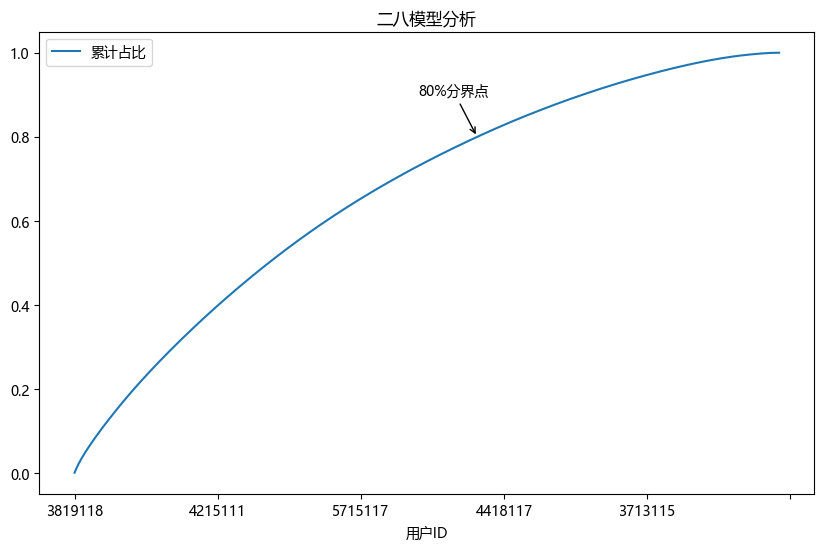

```python
import pandas as pd
import matplotlib.pyplot as plt
```


```python
data = pd.read_csv('用户下单数据.csv', 
                   engine='python', 
                   encoding='gbk')
```


```python
data.head()
```


<div>
<style scoped>
    .dataframe tbody tr th:only-of-type {
        vertical-align: middle;
    }

    .dataframe tbody tr th {
        vertical-align: top;
    }

    .dataframe thead th {
        text-align: right;
    }
</style>
<table border="1" class="dataframe">
  <thead>
    <tr style="text-align: right;">
      <th></th>
      <th>用户ID</th>
      <th>用户出生日期</th>
      <th>性别</th>
      <th>婚姻状况</th>
      <th>文化程度</th>
      <th>下单时间</th>
      <th>订单ID</th>
      <th>交易金额</th>
    </tr>
  </thead>
  <tbody>
    <tr>
      <th>0</th>
      <td>6414111</td>
      <td>1991/8/24</td>
      <td>男</td>
      <td>已婚</td>
      <td>本科</td>
      <td>2020/1/1 17:41</td>
      <td>1000595826</td>
      <td>402.765811</td>
    </tr>
    <tr>
      <th>1</th>
      <td>6516117</td>
      <td>1983/7/21</td>
      <td>女</td>
      <td>已婚</td>
      <td>博士</td>
      <td>2021/10/15 22:47</td>
      <td>1000610643</td>
      <td>545.273062</td>
    </tr>
    <tr>
      <th>2</th>
      <td>6714112</td>
      <td>1986/6/21</td>
      <td>女</td>
      <td>已婚</td>
      <td>博士</td>
      <td>2020/11/22 09:45</td>
      <td>1001934364</td>
      <td>256.716973</td>
    </tr>
    <tr>
      <th>3</th>
      <td>5311117</td>
      <td>1978/5/25</td>
      <td>女</td>
      <td>未婚</td>
      <td>大专</td>
      <td>2021/3/26 11:53</td>
      <td>1007749907</td>
      <td>275.547080</td>
    </tr>
    <tr>
      <th>4</th>
      <td>4316113</td>
      <td>1979/8/1</td>
      <td>男</td>
      <td>未婚</td>
      <td>大专</td>
      <td>2021/7/10 18:59</td>
      <td>1007770144</td>
      <td>1023.500156</td>
    </tr>
  </tbody>
</table>
</div>


```python
data.info()
```

    <class 'pandas.core.frame.DataFrame'>
    RangeIndex: 5000 entries, 0 to 4999
    Data columns (total 8 columns):
     #   Column  Non-Null Count  Dtype  
    ---  ------  --------------  -----  
     0   用户ID    5000 non-null   int64  
     1   用户出生日期  5000 non-null   object 
     2   性别      5000 non-null   object 
     3   婚姻状况    5000 non-null   object 
     4   文化程度    5000 non-null   object 
     5   下单时间    5000 non-null   object 
     6   订单ID    5000 non-null   int64  
     7   交易金额    5000 non-null   float64
    dtypes: float64(1), int64(2), object(5)
    memory usage: 312.6+ KB
    


```python
data['用户ID'] = data['用户ID'].astype('str')
data['订单ID'] = data['订单ID'].astype('str')
```


```python
data.dtypes
```


    用户ID       object
    用户出生日期     object
    性别         object
    婚姻状况       object
    文化程度       object
    下单时间       object
    订单ID       object
    交易金额      float64
    dtype: object


```python
data.describe().round(2)
```


<div>
<style scoped>
    .dataframe tbody tr th:only-of-type {
        vertical-align: middle;
    }

    .dataframe tbody tr th {
        vertical-align: top;
    }

    .dataframe thead th {
        text-align: right;
    }
</style>
<table border="1" class="dataframe">
  <thead>
    <tr style="text-align: right;">
      <th></th>
      <th>交易金额</th>
    </tr>
  </thead>
  <tbody>
    <tr>
      <th>count</th>
      <td>5000.00</td>
    </tr>
    <tr>
      <th>mean</th>
      <td>573.83</td>
    </tr>
    <tr>
      <th>std</th>
      <td>280.69</td>
    </tr>
    <tr>
      <th>min</th>
      <td>0.96</td>
    </tr>
    <tr>
      <th>25%</th>
      <td>356.97</td>
    </tr>
    <tr>
      <th>50%</th>
      <td>572.71</td>
    </tr>
    <tr>
      <th>75%</th>
      <td>785.03</td>
    </tr>
    <tr>
      <th>max</th>
      <td>1311.24</td>
    </tr>
  </tbody>
</table>
</div>


```python
df_groupby = data.groupby('用户ID')['交易金额'].sum().reset_index().sort_values(by='交易金额', ascending=False)
df_groupby
```


<div>
<style scoped>
    .dataframe tbody tr th:only-of-type {
        vertical-align: middle;
    }

    .dataframe tbody tr th {
        vertical-align: top;
    }

    .dataframe thead th {
        text-align: right;
    }
</style>
<table border="1" class="dataframe">
  <thead>
    <tr style="text-align: right;">
      <th></th>
      <th>用户ID</th>
      <th>交易金额</th>
    </tr>
  </thead>
  <tbody>
    <tr>
      <th>459</th>
      <td>3819118</td>
      <td>5150.367779</td>
    </tr>
    <tr>
      <th>301</th>
      <td>3616119</td>
      <td>4850.650966</td>
    </tr>
    <tr>
      <th>1751</th>
      <td>5715115</td>
      <td>4837.078695</td>
    </tr>
    <tr>
      <th>1661</th>
      <td>5520119</td>
      <td>4652.746513</td>
    </tr>
    <tr>
      <th>2315</th>
      <td>6519120</td>
      <td>4529.086443</td>
    </tr>
    <tr>
      <th>...</th>
      <td>...</td>
      <td>...</td>
    </tr>
    <tr>
      <th>1334</th>
      <td>5114117</td>
      <td>22.149195</td>
    </tr>
    <tr>
      <th>1574</th>
      <td>5418116</td>
      <td>16.875256</td>
    </tr>
    <tr>
      <th>2223</th>
      <td>6416116</td>
      <td>11.936607</td>
    </tr>
    <tr>
      <th>114</th>
      <td>3317113</td>
      <td>9.020897</td>
    </tr>
    <tr>
      <th>800</th>
      <td>4320116</td>
      <td>3.920969</td>
    </tr>
  </tbody>
</table>
<p>2462 rows × 2 columns</p>
</div>


```python
pd.set_option('display.float_format', lambda x: '%.1f' % x)

df_groupby['累计交易金额'] = df_groupby['交易金额'].cumsum()
df_groupby
```


<div>
<style scoped>
    .dataframe tbody tr th:only-of-type {
        vertical-align: middle;
    }

    .dataframe tbody tr th {
        vertical-align: top;
    }

    .dataframe thead th {
        text-align: right;
    }
</style>
<table border="1" class="dataframe">
  <thead>
    <tr style="text-align: right;">
      <th></th>
      <th>用户ID</th>
      <th>交易金额</th>
      <th>累计交易金额</th>
      <th>总交易金额</th>
      <th>累计占比</th>
    </tr>
  </thead>
  <tbody>
    <tr>
      <th>459</th>
      <td>3819118</td>
      <td>5150.4</td>
      <td>5150.4</td>
      <td>2869145.6</td>
      <td>0.0</td>
    </tr>
    <tr>
      <th>301</th>
      <td>3616119</td>
      <td>4850.7</td>
      <td>10001.0</td>
      <td>2869145.6</td>
      <td>0.0</td>
    </tr>
    <tr>
      <th>1751</th>
      <td>5715115</td>
      <td>4837.1</td>
      <td>14838.1</td>
      <td>2869145.6</td>
      <td>0.0</td>
    </tr>
    <tr>
      <th>1661</th>
      <td>5520119</td>
      <td>4652.7</td>
      <td>19490.8</td>
      <td>2869145.6</td>
      <td>0.0</td>
    </tr>
    <tr>
      <th>2315</th>
      <td>6519120</td>
      <td>4529.1</td>
      <td>24019.9</td>
      <td>2869145.6</td>
      <td>0.0</td>
    </tr>
    <tr>
      <th>...</th>
      <td>...</td>
      <td>...</td>
      <td>...</td>
      <td>...</td>
      <td>...</td>
    </tr>
    <tr>
      <th>1334</th>
      <td>5114117</td>
      <td>22.1</td>
      <td>2869103.9</td>
      <td>2869145.6</td>
      <td>1.0</td>
    </tr>
    <tr>
      <th>1574</th>
      <td>5418116</td>
      <td>16.9</td>
      <td>2869120.7</td>
      <td>2869145.6</td>
      <td>1.0</td>
    </tr>
    <tr>
      <th>2223</th>
      <td>6416116</td>
      <td>11.9</td>
      <td>2869132.7</td>
      <td>2869145.6</td>
      <td>1.0</td>
    </tr>
    <tr>
      <th>114</th>
      <td>3317113</td>
      <td>9.0</td>
      <td>2869141.7</td>
      <td>2869145.6</td>
      <td>1.0</td>
    </tr>
    <tr>
      <th>800</th>
      <td>4320116</td>
      <td>3.9</td>
      <td>2869145.6</td>
      <td>2869145.6</td>
      <td>1.0</td>
    </tr>
  </tbody>
</table>
<p>2462 rows × 5 columns</p>
</div>


```python
df_groupby['总交易金额'] = df_groupby['交易金额'].sum()
df_groupby
```


<div>
<style scoped>
    .dataframe tbody tr th:only-of-type {
        vertical-align: middle;
    }

    .dataframe tbody tr th {
        vertical-align: top;
    }

    .dataframe thead th {
        text-align: right;
    }
</style>
<table border="1" class="dataframe">
  <thead>
    <tr style="text-align: right;">
      <th></th>
      <th>用户ID</th>
      <th>交易金额</th>
      <th>累计交易金额</th>
      <th>总交易金额</th>
      <th>累计占比</th>
    </tr>
  </thead>
  <tbody>
    <tr>
      <th>459</th>
      <td>3819118</td>
      <td>5150.4</td>
      <td>5150.4</td>
      <td>2869145.6</td>
      <td>0.0</td>
    </tr>
    <tr>
      <th>301</th>
      <td>3616119</td>
      <td>4850.7</td>
      <td>10001.0</td>
      <td>2869145.6</td>
      <td>0.0</td>
    </tr>
    <tr>
      <th>1751</th>
      <td>5715115</td>
      <td>4837.1</td>
      <td>14838.1</td>
      <td>2869145.6</td>
      <td>0.0</td>
    </tr>
    <tr>
      <th>1661</th>
      <td>5520119</td>
      <td>4652.7</td>
      <td>19490.8</td>
      <td>2869145.6</td>
      <td>0.0</td>
    </tr>
    <tr>
      <th>2315</th>
      <td>6519120</td>
      <td>4529.1</td>
      <td>24019.9</td>
      <td>2869145.6</td>
      <td>0.0</td>
    </tr>
    <tr>
      <th>...</th>
      <td>...</td>
      <td>...</td>
      <td>...</td>
      <td>...</td>
      <td>...</td>
    </tr>
    <tr>
      <th>1334</th>
      <td>5114117</td>
      <td>22.1</td>
      <td>2869103.9</td>
      <td>2869145.6</td>
      <td>1.0</td>
    </tr>
    <tr>
      <th>1574</th>
      <td>5418116</td>
      <td>16.9</td>
      <td>2869120.7</td>
      <td>2869145.6</td>
      <td>1.0</td>
    </tr>
    <tr>
      <th>2223</th>
      <td>6416116</td>
      <td>11.9</td>
      <td>2869132.7</td>
      <td>2869145.6</td>
      <td>1.0</td>
    </tr>
    <tr>
      <th>114</th>
      <td>3317113</td>
      <td>9.0</td>
      <td>2869141.7</td>
      <td>2869145.6</td>
      <td>1.0</td>
    </tr>
    <tr>
      <th>800</th>
      <td>4320116</td>
      <td>3.9</td>
      <td>2869145.6</td>
      <td>2869145.6</td>
      <td>1.0</td>
    </tr>
  </tbody>
</table>
<p>2462 rows × 5 columns</p>
</div>


```python
df_groupby['累计占比'] = df_groupby['累计交易金额'] / df_groupby['总交易金额']
df_groupby['累计占比百分数'] = df_groupby['累计占比'].apply(lambda x: f'{x * 100:.2f}%')
df_groupby
```


<div>
<style scoped>
    .dataframe tbody tr th:only-of-type {
        vertical-align: middle;
    }

    .dataframe tbody tr th {
        vertical-align: top;
    }

    .dataframe thead th {
        text-align: right;
    }
</style>
<table border="1" class="dataframe">
  <thead>
    <tr style="text-align: right;">
      <th></th>
      <th>用户ID</th>
      <th>交易金额</th>
      <th>累计交易金额</th>
      <th>总交易金额</th>
      <th>累计占比</th>
      <th>累计占比百分数</th>
    </tr>
  </thead>
  <tbody>
    <tr>
      <th>459</th>
      <td>3819118</td>
      <td>5150.4</td>
      <td>5150.4</td>
      <td>2869145.6</td>
      <td>0.0</td>
      <td>0.18%</td>
    </tr>
    <tr>
      <th>301</th>
      <td>3616119</td>
      <td>4850.7</td>
      <td>10001.0</td>
      <td>2869145.6</td>
      <td>0.0</td>
      <td>0.35%</td>
    </tr>
    <tr>
      <th>1751</th>
      <td>5715115</td>
      <td>4837.1</td>
      <td>14838.1</td>
      <td>2869145.6</td>
      <td>0.0</td>
      <td>0.52%</td>
    </tr>
    <tr>
      <th>1661</th>
      <td>5520119</td>
      <td>4652.7</td>
      <td>19490.8</td>
      <td>2869145.6</td>
      <td>0.0</td>
      <td>0.68%</td>
    </tr>
    <tr>
      <th>2315</th>
      <td>6519120</td>
      <td>4529.1</td>
      <td>24019.9</td>
      <td>2869145.6</td>
      <td>0.0</td>
      <td>0.84%</td>
    </tr>
    <tr>
      <th>...</th>
      <td>...</td>
      <td>...</td>
      <td>...</td>
      <td>...</td>
      <td>...</td>
      <td>...</td>
    </tr>
    <tr>
      <th>1334</th>
      <td>5114117</td>
      <td>22.1</td>
      <td>2869103.9</td>
      <td>2869145.6</td>
      <td>1.0</td>
      <td>100.00%</td>
    </tr>
    <tr>
      <th>1574</th>
      <td>5418116</td>
      <td>16.9</td>
      <td>2869120.7</td>
      <td>2869145.6</td>
      <td>1.0</td>
      <td>100.00%</td>
    </tr>
    <tr>
      <th>2223</th>
      <td>6416116</td>
      <td>11.9</td>
      <td>2869132.7</td>
      <td>2869145.6</td>
      <td>1.0</td>
      <td>100.00%</td>
    </tr>
    <tr>
      <th>114</th>
      <td>3317113</td>
      <td>9.0</td>
      <td>2869141.7</td>
      <td>2869145.6</td>
      <td>1.0</td>
      <td>100.00%</td>
    </tr>
    <tr>
      <th>800</th>
      <td>4320116</td>
      <td>3.9</td>
      <td>2869145.6</td>
      <td>2869145.6</td>
      <td>1.0</td>
      <td>100.00%</td>
    </tr>
  </tbody>
</table>
<p>2462 rows × 6 columns</p>
</div>


```python
plt.rcParams['font.sans-serif'] = 'Microsoft YaHei'
df_groupby.plot(x='用户ID', y='累计占比', title='二八模型分析', figsize=(10, 6))
plt.annotate('80%分界点', xy=(1406, 0.8), xytext=(1200, 0.9), arrowprops={'arrowstyle': '->'})
plt.show()
```


    

    


```python
df_VIP = df_groupby.query('累计占比 < 0.8')
df_VIP
```


<div>
<style scoped>
    .dataframe tbody tr th:only-of-type {
        vertical-align: middle;
    }

    .dataframe tbody tr th {
        vertical-align: top;
    }

    .dataframe thead th {
        text-align: right;
    }
</style>
<table border="1" class="dataframe">
  <thead>
    <tr style="text-align: right;">
      <th></th>
      <th>用户ID</th>
      <th>交易金额</th>
      <th>累计交易金额</th>
      <th>总交易金额</th>
      <th>累计占比</th>
      <th>累计占比百分数</th>
    </tr>
  </thead>
  <tbody>
    <tr>
      <th>459</th>
      <td>3819118</td>
      <td>5150.4</td>
      <td>5150.4</td>
      <td>2869145.6</td>
      <td>0.0</td>
      <td>0.18%</td>
    </tr>
    <tr>
      <th>301</th>
      <td>3616119</td>
      <td>4850.7</td>
      <td>10001.0</td>
      <td>2869145.6</td>
      <td>0.0</td>
      <td>0.35%</td>
    </tr>
    <tr>
      <th>1751</th>
      <td>5715115</td>
      <td>4837.1</td>
      <td>14838.1</td>
      <td>2869145.6</td>
      <td>0.0</td>
      <td>0.52%</td>
    </tr>
    <tr>
      <th>1661</th>
      <td>5520119</td>
      <td>4652.7</td>
      <td>19490.8</td>
      <td>2869145.6</td>
      <td>0.0</td>
      <td>0.68%</td>
    </tr>
    <tr>
      <th>2315</th>
      <td>6519120</td>
      <td>4529.1</td>
      <td>24019.9</td>
      <td>2869145.6</td>
      <td>0.0</td>
      <td>0.84%</td>
    </tr>
    <tr>
      <th>...</th>
      <td>...</td>
      <td>...</td>
      <td>...</td>
      <td>...</td>
      <td>...</td>
      <td>...</td>
    </tr>
    <tr>
      <th>1788</th>
      <td>5811111</td>
      <td>904.3</td>
      <td>2291598.2</td>
      <td>2869145.6</td>
      <td>0.8</td>
      <td>79.87%</td>
    </tr>
    <tr>
      <th>2385</th>
      <td>6619120</td>
      <td>903.8</td>
      <td>2292501.9</td>
      <td>2869145.6</td>
      <td>0.8</td>
      <td>79.90%</td>
    </tr>
    <tr>
      <th>2139</th>
      <td>6314112</td>
      <td>902.0</td>
      <td>2293403.9</td>
      <td>2869145.6</td>
      <td>0.8</td>
      <td>79.93%</td>
    </tr>
    <tr>
      <th>866</th>
      <td>4418120</td>
      <td>901.7</td>
      <td>2294305.6</td>
      <td>2869145.6</td>
      <td>0.8</td>
      <td>79.96%</td>
    </tr>
    <tr>
      <th>55</th>
      <td>3219113</td>
      <td>901.4</td>
      <td>2295207.1</td>
      <td>2869145.6</td>
      <td>0.8</td>
      <td>80.00%</td>
    </tr>
  </tbody>
</table>
<p>1407 rows × 6 columns</p>
</div>


